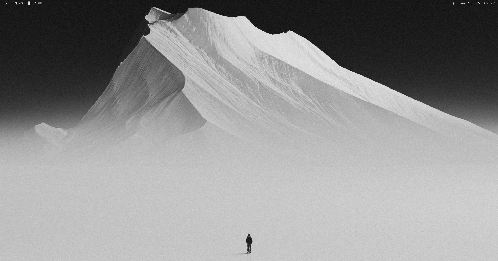
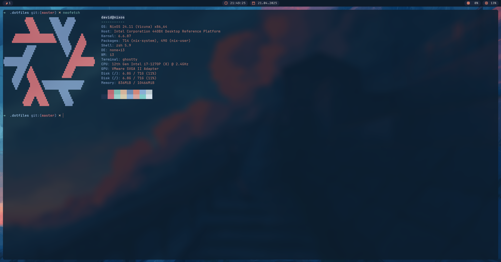

# NixOS Personal Setup
This is my personal NixOS configuration with [home-manager](https://github.com/nix-community/home-manager) as a flake (WiP).

This configuration is what I primarily use in my daily work on a virtual machine.
The goal is to keep things as lightweight as possible while still having all the tools I need—without any extra hassle or additional setup. That's why I intentionally left out things like filebrowser and similar tools, to maintain a clean and minimal workspace.

The design reflects that mindset.
The ricing could definitely be more extensive, but for me, it's more than enough.

**WM:** [i3](https://i3wm.org/)  
**DM:** [ly](https://github.com/fairyglade/ly)  
**Shell:** [oh-my-zsh](https://ohmyz.sh/)  
**Terminal:** [ghostty](https://ghostty.org/)  
**Compositor:** [picom](https://github.com/yshui/picom)  
**Bar:** [polybar](https://github.com/polybar/polybar)  
**Editor:** [neovim](https://neovim.io/)  
**Wallpaper:** Art by [jrmnt](https://wallhaven.cc/user/jrmnt)  
**Colorscheme** i call it `mountain-dawn` and it depends on the wallpaper (maybe less colors would be better?)

<details>
<summary>Colorscheme</summary>
  
-  `#25262A` background
-  `#E2E2E2` foreground
-  `#E2E2E2` cursor
-  `#3E3F44` select-back
-  `#ffffff` select-fore
-  `#2E2F33` black
-  `#D88C8C` red
-  `#A7D9AF` green
-  `#E9D8AD` yellow
-  `#AFC4EA` blue
-  `#D5B5F2` magenta
-  `#A4DAE0` cyan
-  `#E2E2E2` gray
-  `#3D3E42` gray-alt
-  `#EDA3A3` red-alt
-  `#BAE6C0` green-alt
-  `#F6E8B8` yellow-alt
-  `#C1D1F3` blue-alt
-  `#E0C3F7` magenta-alt
-  `#B8E4EA` cyan-alt
-  `#ffffff` white

</details>

## How to use
Simply clone the repository in `~/.dotfiles/` and run the nix cmds.
```bash
git clone https://github.com/david-schor/nixos-config.git
```
```bash
sudo nixos-rebuild switch --flake .#nixos
```
```bash
home-manager switch --flake .#nixos
```
Just don't forget to configure some personal things.

## Screenshots

[](./screenshots/screen_empty.png)
[](./screenshots/screen.png)

## Additional
Mostly all configurations are separated as modules, so future changes are easy to made.
As already said, this configurations is only used as a VM on `VMware Workstation`
So if it flackers or lags appear, activate `Accelerate 3D graphics` in the VM settings.
