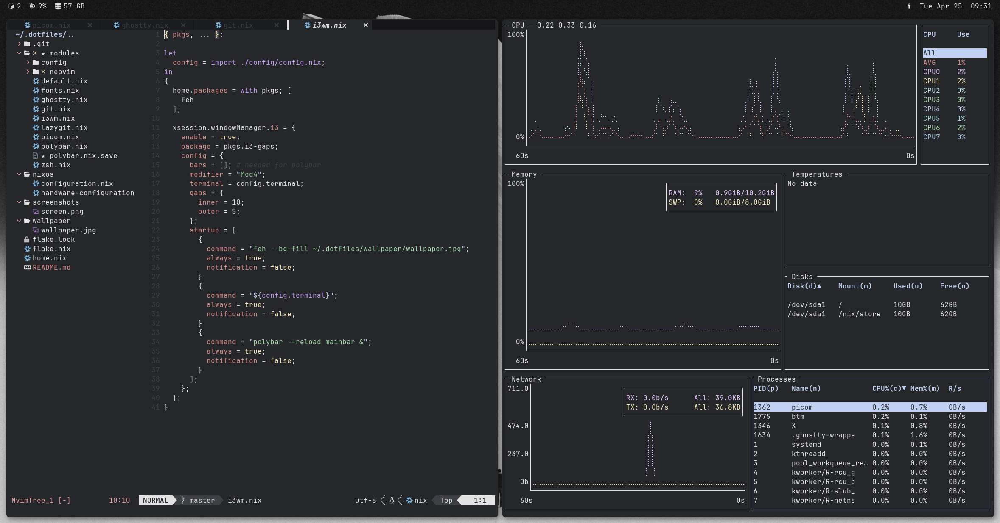

# NixOS Personal Setup
**NixOS | flakes | home-manager | i3wm | polybar | oh-my-zsh | ghostty**

This is my personal NixOS configuration (WiP).

Mostly all configurations are separated as modules, so future changes are easy to made.
This configurations is mostly used as a VM on 'VMware Workstation' -> if it flackers, activate 'Accelerate 3D graphics' in the VM settings.

## Screenshots

